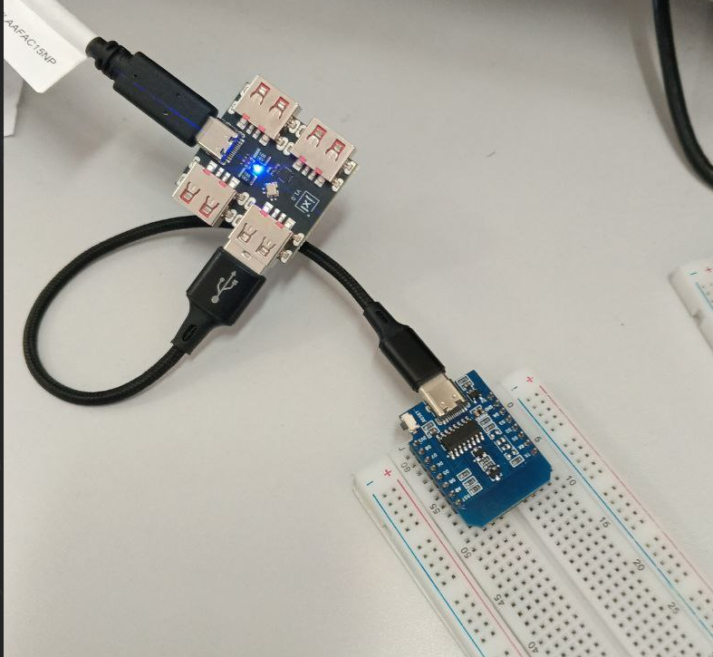

# Arduino
Learning arduino for NGU

# Clock  (часы) [ТЫК](/ClockForCar/)
##  В первой моей машине были подобные часы, когда думал, что сделать, почему-то захотелось реализовать именно их. На данной снимке изображен перввый прототип написанный на Arduino Nano с использованием сдвигового регистра 74HC595 для отображения необходимых цифр на 7-ми сегментном дисплее модели 5641AS. подтяжка земли реализована через транзисторы, на Gate(затвор), подаётся сигнал для замыкания межжду собой Drain(сток) и Source(исток), модель транзистора использовалась **IRFZ44N**. Проект находится по пути [ТЫК](/ClockForCar/ClockForCar.ino)

[Datasheet_IRFZ44N](/datasheets/IRFZ44N.pdf)

> Схема транзистора IRFZ44N

# Clock (часы) [Перешёл на VS Code](/Clock/Clock/)

# ESP8266 (Wemos V1 mini) [WiFi ТЫК](./esp8266dir/ESP8266/)
## Реализовал на данный момент модуль с просто html формой для указания WiFi к которому подключаться, либо установка времени в ручную в часах, что были описаны выше

> плата esp8266 со стартовой прошивкой